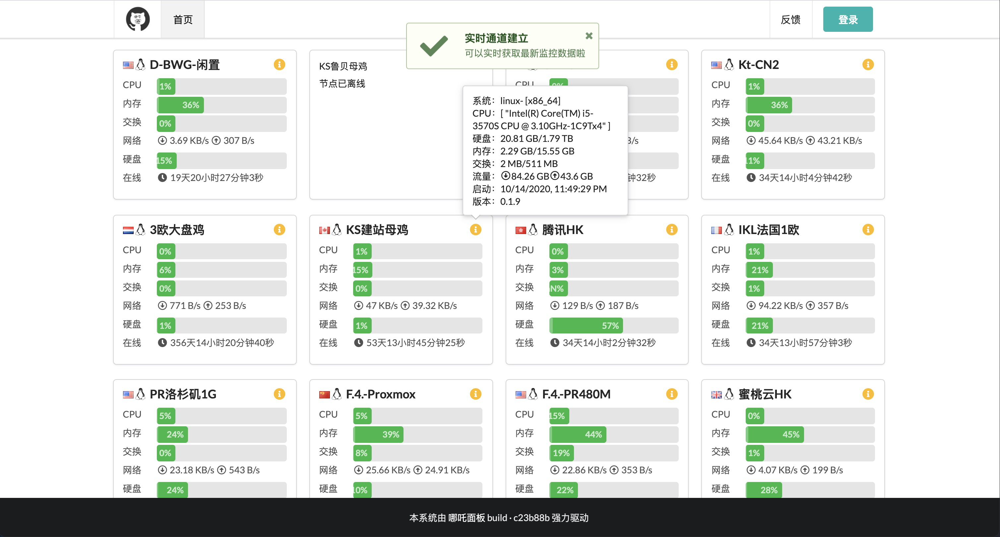
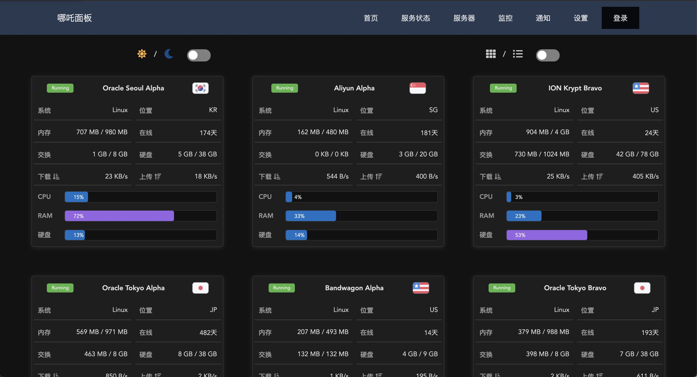
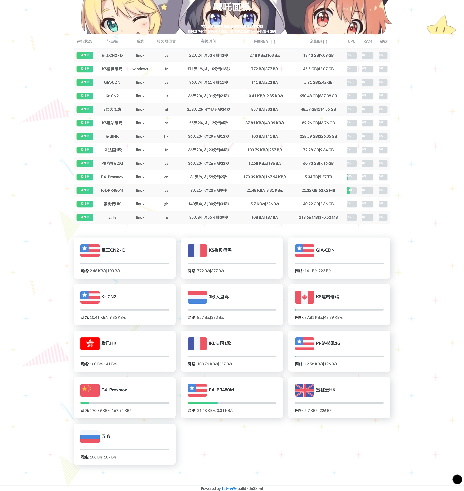
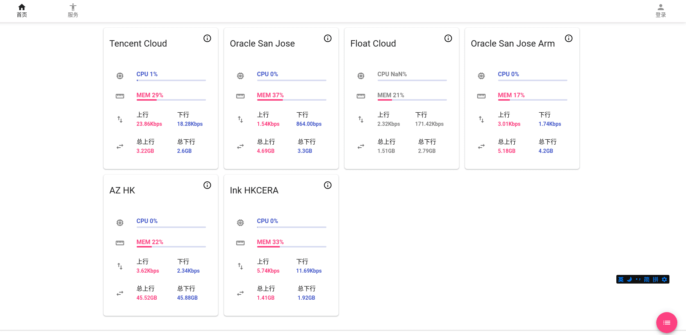
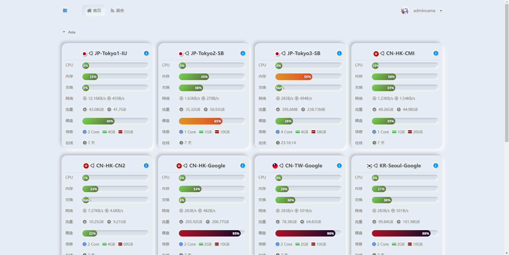
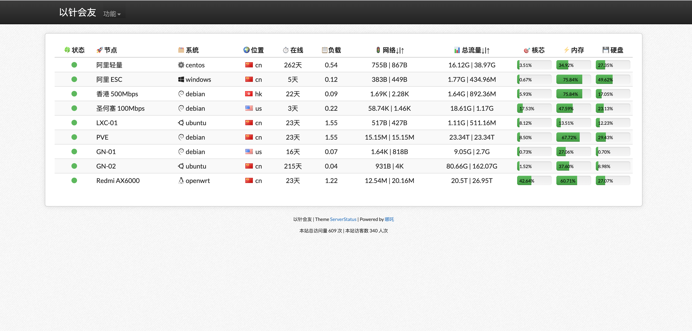

<div align="center">
  <br>
  
  <br>
  <br><br>
&nbsp;&nbsp;<a href="https://github.com/nezhahq/nezha" target="_blank">
    </a>
  <br>
  <br>
  <p><b>Nezha Monitoring: Self-hostable, lightweight, servers and websites monitoring and O&M tool.</b></p>
  <p>Supports <b>monitoring</b> system status, HTTP, TCP, Ping and supports <b>push alerts</b>, run scheduled tasks and <b>web terminal</b>.</p>
</div>


## Abstract
基于哪吒V0版本进行二次修改，主要更新了GEOIP库和管理界面复制的链接，同时进行了一些样式优化。尽可能减少更新，提供稳定版本。

一键安装脚本如下：

```shell
curl -L https://raw.githubusercontent.com/railzen/nezhazero/main/installScript/nezhazero.sh -o nezhazero.sh && chmod +x nezhazero.sh && ./nezhazero.sh
```


## User Guide

- [English](https://nezhahq.github.io/en_US/index.html)
- [中文文档](https://nezhahq.github.io/index.html)

## Screenshots

| Default Theme                                                                                 | DayNight [@JackieSung](https://github.com/JackieSung4ev)                                               | hotaru                                                                     |
| ---------------------------------------------------------------------------------------- | ------------------------------------------------------------------------------------------------------ | -------------------------------------------------------------------------- |
|                               |                             |  |
| <div align="center"><b>Neko Mdui <a href="https://github.com/MikoyChinese">@MikoyChinese</a></b></div> |      <div align="center"><b>AngelKanade <a href="https://github.com/adminsama">@adminsama</a></b></div>         |<div align="center"><b>ServerStatus <a href="https://github.com/unclezs">@unclezs</a></b></div> |
|                                               |                    |        |

## Supported Languages

- English
- 中文

You can change the dashboard language in the settings page (`/setting`) after the dashboard is installed.

