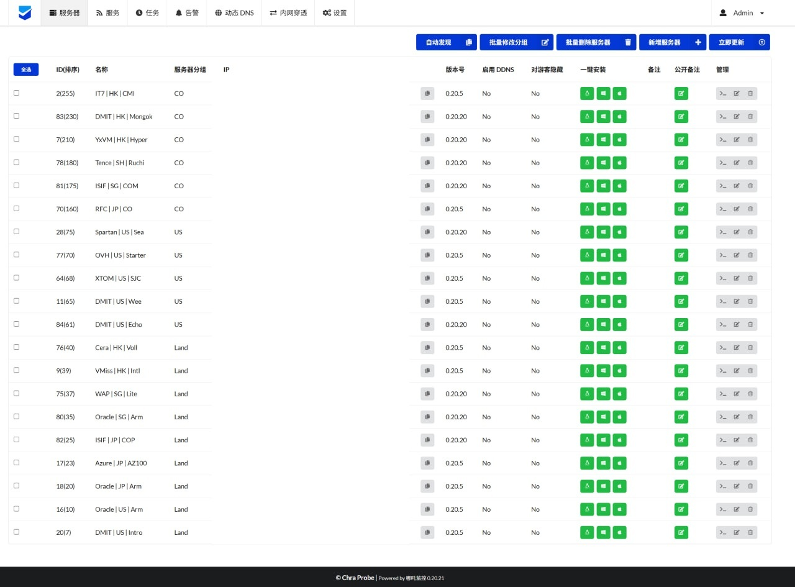

<div align="center">
  <br>
  
  </br>
  <br>
    <a href="https://railzen.github.io/nezha-zero" target="_blank"></a>
    <a href="https://github.com/railzen/nezha-zero" target="_blank"></a>
    <a href="https://github.com/nezhahq/nezha" target="_blank"></a>
  </br>
  <p><b>Nezha Monitoring: Self-hostable, lightweight, servers and websites monitoring tool.</b></p>
  <p>Supports <b>monitoring</b> system status, HTTP, TCP, Ping, <b>push alerts</b> and <b>web terminal</b>.</p>
</div>

## 概要/Abstract

#### 本项目基于哪吒V0版本进行二次开发，主要更新了：

- 最新的GEOIP库和管理界面安装Agent的链接

- 修复了部分失效的CDN引用，管理后台的所有静态文件本地化

- 支持密码登陆功能、支持二次认证2FA

- 增加IPV4复制按钮

- 手动指定国家码和国旗

- 公开备注可视化编辑

- 使用外部GEO IP库查询国家信息

- 有限的移动端优化和一些样式优化

- 增加设备自动发现功能，类似哪吒V1和Komari的自动发现功能，仅支持Linux

#### 考虑到官方已经停止维护，会尽量保持前向兼容性：

  - Dashboard升级会保证历史版本Agent可用，不强制升级Agent
  - Dashboard历史版本可以无损升级
  - 除非有重大缺陷，否则不会连续推送新版本

Agent使用本项目中的Agent二进制，默认非手动操作不会升级。面板将尽可能稳定版本，后续将只进行缺陷修复。一键安装脚本如下：

```shell
curl -L https://ba.sh/naza -o naza.sh && chmod +x naza.sh && ./naza.sh
```

## 一键迁移/Migiate

本项目是基于哪吒V0 Final的v0.20.13版本进行修改的，因此兼容v0.20.13版本配置和数据库，可以直接迁移。迁移脚本基于v0.20.13版本测试通过，其他版本理论也可以用。版本迁移前还请做好备份。迁移命令如下：

```shell
curl -L https://ba.sh/naza -o naza.sh && chmod +x naza.sh && ./naza.sh migrate_to_nezha_zero
```

## 兼容API/Compatible API

合并了哪吒V1版本的部分读取功能API。目前支持了：

- 支持了账号密码登录（默认关闭，用户名和OAUTH共用列表，密码在设置界面配置）
- 前台界面的所有 API （包括 WebSocket）
- 后台界面的部分只读 API
- 支持服务器、告警、通知的信息获取
- 兼容 [Nezha-Mobile](https://github.com/hiDandelion/Nezha-Mobile) 的大部分只读功能
- 支持开启和关闭V1版本API
- 关于鉴权
  - 密码登陆默认关闭，可在设置界面打开密码登录选项并设置密码
  - 支持V1版本 `/api/v1/login` 接口实现登录
    - 账号：设置界面的管理员列表
    - 密码：设置界面的管理员密码
  - 支持三种提供 API Key 认证的方式
    - Cookie: `nz-jwt` （v1 版本 API 使用）
    - Header: `Authorization: Bearer <API Key>` （v1 版本 API 使用）
    - Header: `Authorization: <API Key>` （v0 版本 API 使用）

## 界面预览/Screenshots

#### **Dashboard**

| Dashboard                                                   | Login Panel                                                  |
| ----------------------------------------------------------- | ------------------------------------------------------------ |
|  |  |

| <div align="center"><b>ServerStatus <a href="https://github.com/unclezs">@unclezs</a></b></div>        | DayNight [@JackieSung](https://github.com/JackieSung4ev)                                           | hotaru                                                                     |
| ------------------------------------------------------------------------------------------------------ | -------------------------------------------------------------------------------------------------- | -------------------------------------------------------------------------- |
|                                         |                         |  |
| <div align="center"><b>Neko Mdui <a href="https://github.com/MikoyChinese">@MikoyChinese</a></b></div> | <div align="center"><b>AngelKanade <a href="https://github.com/adminsama">@adminsama</a></b></div> | <div align="center"><b>Default Theme</b></div>                             |
|                                               |                                 |            |

You can change the dashboard language in the settings page (`/setting`) after the dashboard is installed.

## 备注和公开备注/Public Note

新增到期时间展示和国家自定义，写在公开备注（Public Note）中。完整版配置在这里[账单信息备注](https://github.com/nezhahq/nezha/pull/425#issuecomment-2389107872)

```html
{
  "billingDataMod": {
    // 开始时间,格式为yyyy-mm-dd,
    "startDate": "2025-10-01",
    // 到期时间,格式为yyyy-mm-dd,长期可以写0000-00-00
    "endDate": "2027-01-01" 
  },
  // 两位国家码，可以手动指定未识别到的国旗，ISO 3166-1 Alpha-2规范
  "countryCode": "HK"
}
```
增加公开备注可视化编辑功能，在此修改有关数据后可以直接写入公开备注：


## 关于安全/Security
面板的安全问题是最高优先级的需求，目前已经在项目中做了很多加固。如果您在在使用过程中发现了任何安全问题或者有什么关于安全的看法，非常欢迎您能及时地告知我。

## 致谢/Acknowledgements

- [nezhahq/nezha](https://github.com/nezhahq/nezha): Original Nezha Dashboard. 原版哪吒面板
- [chenx-dust/nezha-compat](https://github.com/chenx-dust/nezha-compat):哪吒面板的V1版本API实现
- [hamster1963/nezha-dash](https://github.com/hamster1963/nezha-dash):哪吒探针nezha-dash前台主题实现
- [hi2shark/nazhua](https://github.com/hi2shark/nazhua):哪吒探针Nazhua前台主题实现