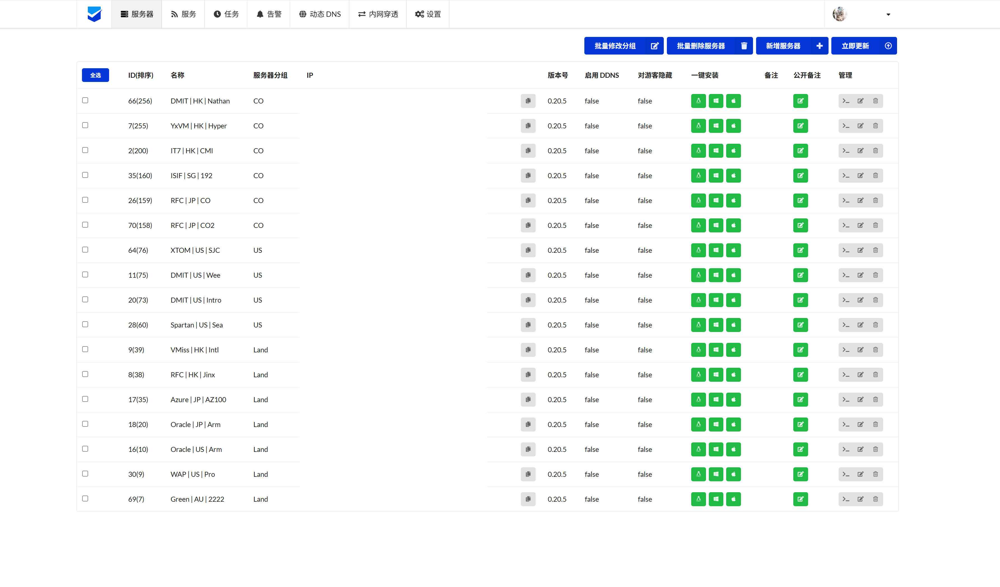
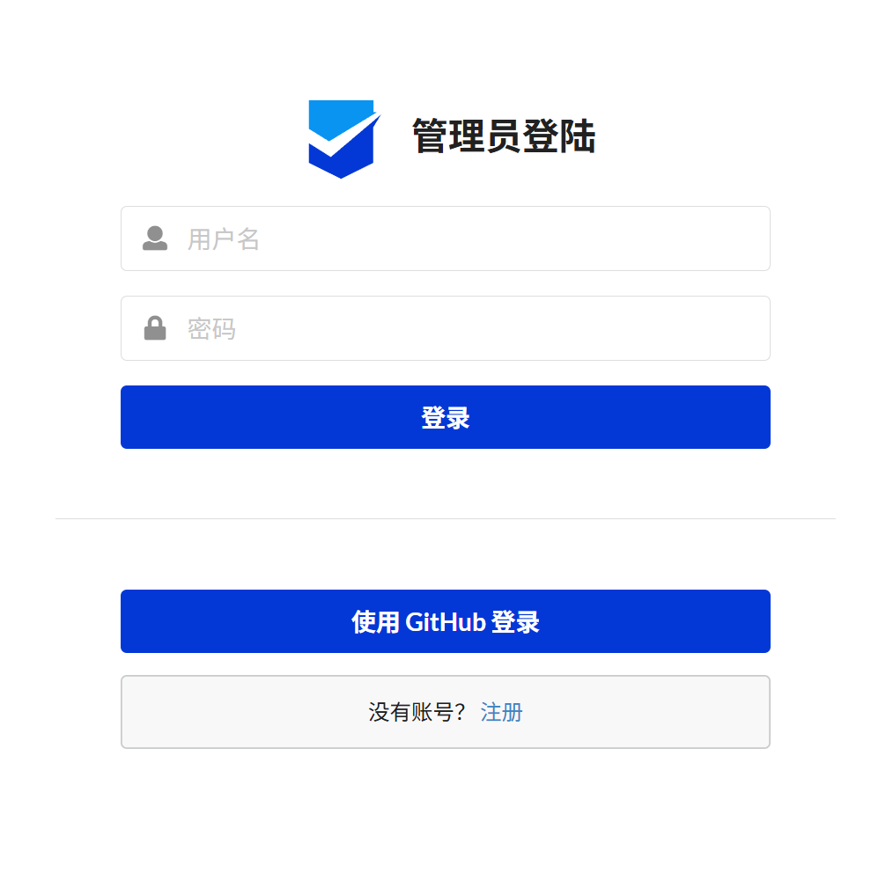
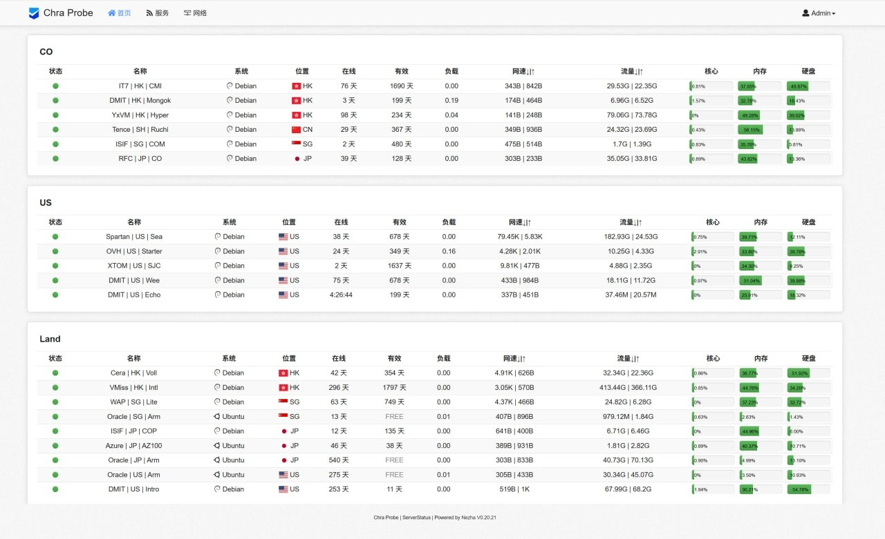
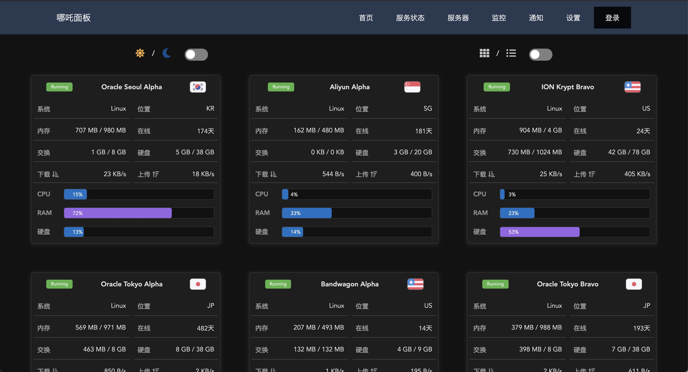
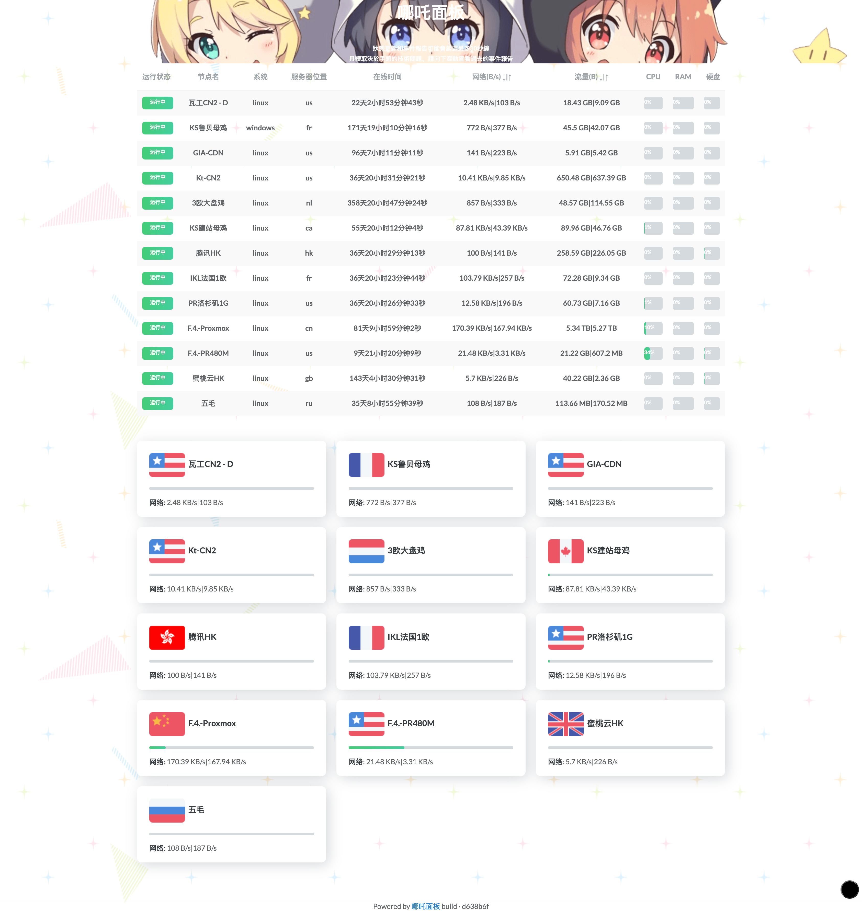
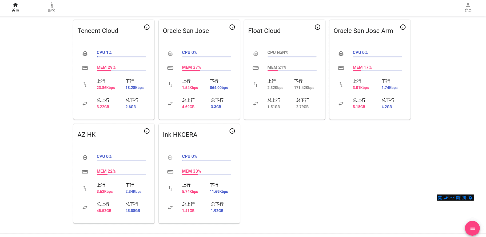
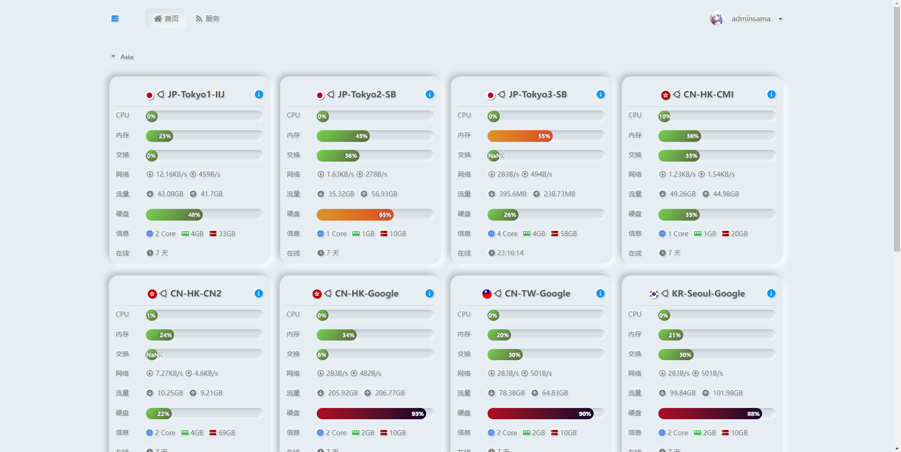
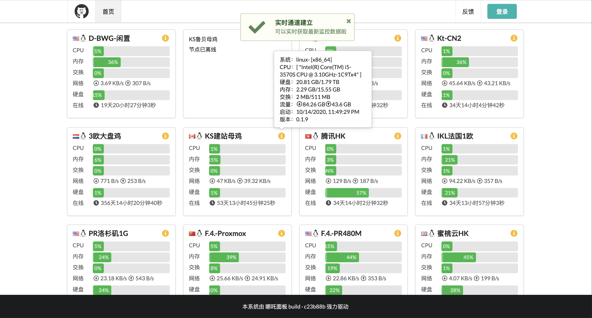

<div align="center">
  <br>
  
  </br>
  <br>
	<a href="https://nezha-v0.mereith.dev/guide/dashboard.html" target="_blank"></a>
	<a href="https://github.com/railzen/nezha-zero" target="_blank"></a>
	<a href="https://github.com/nezhahq/agent/releases/tag/v0.20.5" target="_blank"></a>
	<a href="https://github.com/nezhahq/nezha" target="_blank"></a>
  </br>
  <p><b>Nezha Monitoring: Self-hostable, lightweight, servers and websites monitoring tool.</b></p>
  <p>Supports <b>monitoring</b> system status, HTTP, TCP, Ping, <b>push alerts</b> and <b>web terminal</b>.</p>
</div>


## 概要/Abstract
本项目基于哪吒V0版本进行二次修改，主要更新了GEOIP库和管理界面安装Agent的链接，修复了部分失效的CDN引用，增加用户名密码登陆功能和IP复制功能，增加设备自动发现（仅支持Linux），同时进行了一些样式优化。

最新Agent版本以上面标签展示为准，放在Release里面仅便于使用。Agent已经关闭自动升级功能，如无必要不会升级。稳定后面板将尽可能减少更新以稳定版本，但目前还在快速迭代，不建议使用。一键安装脚本如下：

```shell
curl -L https://ba.sh/naza -o naza.sh && chmod +x naza.sh && ./naza.sh
```

## 兼容API/Compatible API

合并了哪吒V1版本的部分读取功能API。目前支持了：

- 支持了账号密码登录（默认关闭，用户名和密码在后台设置后启用）
- 前台界面的所有 API （包括 WebSocket）
- 后台界面的部分只读 API
- 支持服务器、告警、通知的信息获取
- 兼容 [Nezha-Mobile](https://github.com/hiDandelion/Nezha-Mobile) 的大部分只读功能
- 关于鉴权
  - 基于配置文件实现鉴权，密码可以通过修改配置文件后重启面板进行修改
  - 支持V1版本 `/api/v1/login` 接口实现登录
    - 账号：设置界面的管理员列表
    - 密码：设置界面的管理员密码
  - 支持三种提供 API Key 的方式
    - Cookie: `nz-jwt` （v1 版本默认使用）
    - Header: `Authorization: Bearer <API Key>` （v1 版本 API 使用）
    - Header: `Authorization: <API Key>` （v0 版本 API 使用）


## 界面预览/Screenshots


#### **Dashboard**


| Dashboard                                             | Login Panel                                          |
| --------------------- | ------------------------ |
|                              |  |

| <div align="center"><b>ServerStatus <a href="https://github.com/unclezs">@unclezs</a></b></div> | DayNight [@JackieSung](https://github.com/JackieSung4ev)     | hotaru                                                       |
| ------------------------------------------------------------ | ------------------------------------------------------------ | ------------------------------------------------------------ |
|  |  |  |
| <div align="center"><b>Neko Mdui <a href="https://github.com/MikoyChinese">@MikoyChinese</a></b></div> | <div align="center"><b>AngelKanade <a href="https://github.com/adminsama">@adminsama</a></b></div> | <div align="center"><b>Default Theme</b></div>               |
|     |  |  |

You can change the dashboard language in the settings page (`/setting`) after the dashboard is installed.

## 公开备注/Public Note
半透明模式的开关默认隐藏，打开半透明模式需要在自定义代码中添加:
```html
<script>
    // server-status 默认开启分组
    localStorage.setItem("showGroup", true);
    // server-status 默认打开半透明模式
    localStorage.setItem("semiTransparent", true); 
</script>
```

[Pre-Release支持] 新增到期时间展示和国家自定义，写在公开备注（Public Note）中。

```html
{
  "billingDataMod": {
    // 到期时间,格式为yyyy-mm-dd,长期可以写0000-00-00
    "endDate": "2027-01-01" 
  },
  // 两位国家码，可以手动指定未识别到的国旗，ISO 3166-1 Alpha-2规范
  "countryCode": "HK"
}
```

## 致谢/Acknowledgements

- [nezhahq/nezha](https://github.com/nezhahq/nezha): Original Nezha Dashboard. 原版哪吒面板
- [chenx-dust/nezha-compat](https://github.com/chenx-dust/nezha-compat):哪吒面板的V1版本API实现
- [hamster1963/nezha-dash](https://github.com/hamster1963/nezha-dash):哪吒探针nezha-dash前台主题实现
- [hi2shark/nazhua](https://github.com/hi2shark/nazhua):哪吒探针Nazhua前台主题实现
